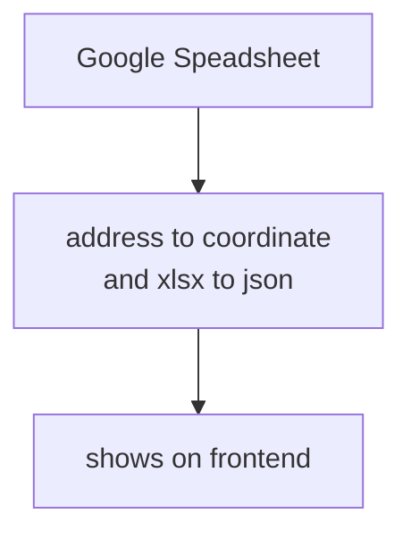

[網站連結](https://trickster-2005.github.io/animal-rescue-map) 

\

[編輯資料庫](https://docs.google.com/spreadsheets/d/1HIcS7Fam7K_gxX_HqXR0XtG6Jox6P6-bIywGP2W-Ats/edit?gid=117763454#gid=117763454)

### Workflow
1. google speardsheet(excel) 共同編輯
2. 串接 geolocation api 讀取地址轉換成經緯度(python)
3. spreadsheet 轉換成 json (python)
4. 顯示在前端

### Diagram

### 資料來源
- [全台救援單位聯絡表單（由野生動物急救站更新）](https://docs.google.com/spreadsheets/d/1RZIaNJx7rapR8vnOtVPdFJOIjyTrcwu0qMR7it9CX7E/edit?gid=2043887075#gid=2043887075)
- [野灣](https://www.wildonetaiwan.org/rescue)

### To-Do
- 思考如何降低載入時間
- 新增載入動畫